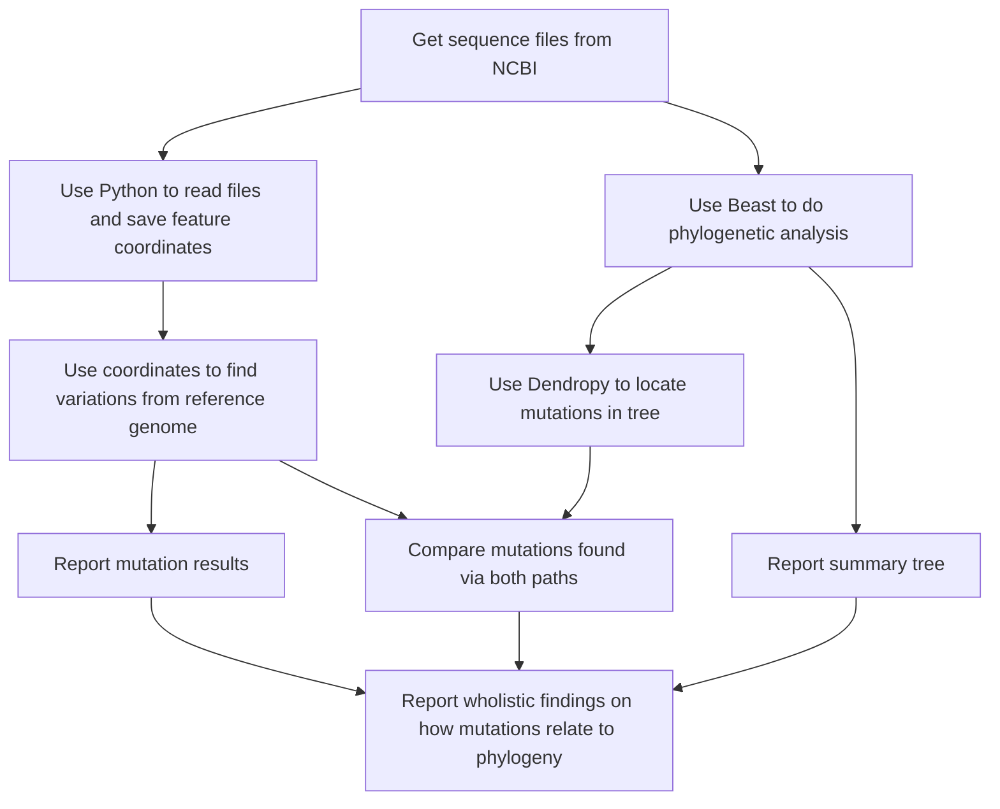

## Welcome to Bellevue College Biology Club

- If you are a member, please see the [contributors page](contributors.md)
- To become a member reach out to our advisors:
  - Arman (abilge@uw.edu) or Dr. Alavares (stay.alvares@bellevuecollege.edu)

### This repo is for our 2023 COVID-19 project

- Poster presented at UW Undergraduate Symposium 2023: [Poster Link](https://zenodo.org/record/7948703)

### Research Data Flow Diagram
This diagram shows our data analysis journey. 

1. We begin by downloading genome data (fasta files).
1. Then we split into two paths:
   - Python code - was written to find differences (mutations) between the original Wuhan COVID-19 strain genome and other strains we selected.
   - Phylogenetic trees - were generated that analyzed all of the selected COVID-19 strain genomes together and hypothesized how mutations affected evolution.
1. Our last objective is to bring our findings (mutations) from both paths together.
   - Our hope is that mutations we find in the trees will also be found by our Python code.
