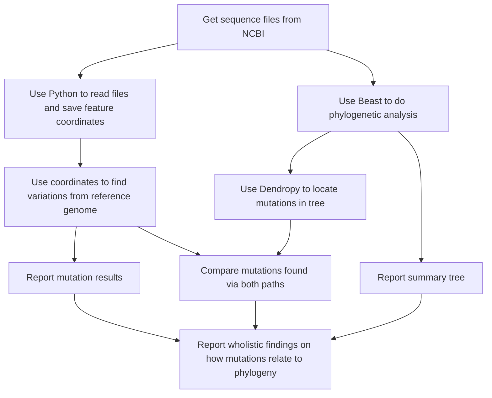

# covid19-notebooks
Jupyter notebooks and file resources for covid-19 uw symposium project

```mermaid
  graph TD;
      A[Get sequence files from NCBI]-->B;
      A --> D[Use Beast to do phylogenetic analysis];
      D --> G[Use Dendropy to locate mutations in tree];
      G --> H[Compare mutations found via both paths];
      B[Use Python to read files and save feature coordinates]-->C;
      C[Use coordinates to find variations from reference genome]-->F[Report mutation results];
      C --> H
      H --> I[Report wholistic findings on how mutations relate to phylogeny]
      D --> E[Report summary tree];
      E --> I
      F --> I
```
