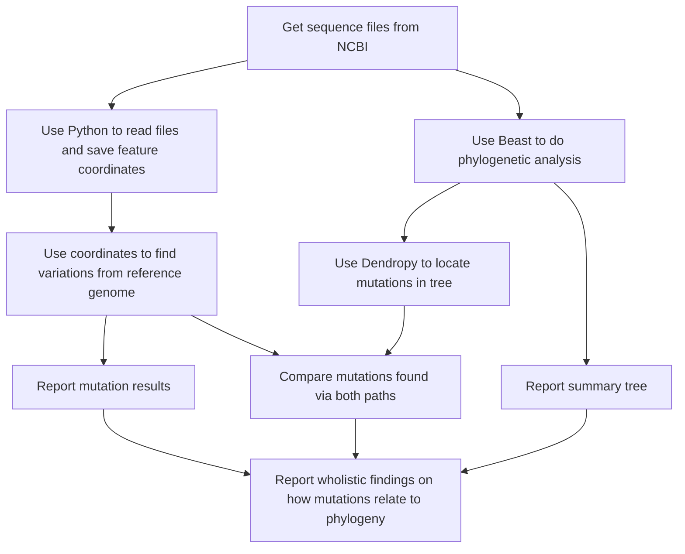

# Welcome to Bellevue College Biology Club

### This repo is for our 2023 COVID-19 project

Poster presented at UW Undergraduate Symposium 2023: [Poster Link](https://zenodo.org/record/7948703)

To become a member reach out to our advisors Arman (abilge@uw.edu) or Dr. Alavares (stay.alvares@bellevuecollege.edu)

If you are a member, please see the [contributor page](contributors.md)

Files are downloaded from: [NCBI](https://www.ncbi.nlm.nih.gov/labs/virus/vssi/#/virus?SeqType_s=Nucleotide&VirusLineage_ss=Severe%20acute%20respiratory%20syndrome%20coronavirus%202,%20taxid:2697049)

Jupyter notebooks and file resources for covid-19 uw symposium project

