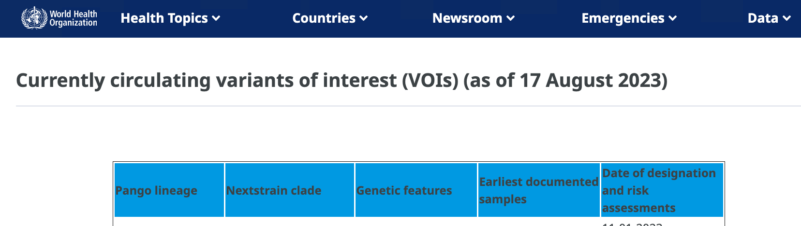

## How To Contribute

- If you are a member, please select from the instructions below.
- To become a member reach out to our advisors:
  - Arman (abilge@uw.edu) or Dr. Alavares (stay.alvares@bellevuecollege.edu)

### How To Add New Strain Sequences

#### Select New Sars-Cov2 Strain
1. Navigate a web browser to the [World Health Organization](https://www.who.int/activities/tracking-SARS-CoV-2-variants).
1. Scroll down to the "Currently circulating variants of interest" table.
 
1. Find a row and copy the first column (Pango lineage) value (e.g. "XBB.1.5").

#### Find NCBI Nucleotide Page
1. Open a new browser tab and navigate to NCBI's SARS-CoV-2 [Data Hub](https://www.ncbi.nlm.nih.gov/labs/virus/vssi/#/virus?SeqType_s=Nucleotide&VirusLineage_ss=Severe%20acute%20respiratory%20syndrome%20coronavirus%202,%20taxid:2697049).
1. Scroll down until you see the "Pango lineage" menu item on the left.
1. Select the "Pango lineage" filter and paste the value from step #3.
1. If the value is recognized a sub-menu will appear from which you can select the same value. If not, then try another "Pango lineage" value from [World Health Organization](https://www.who.int/activities/tracking-SARS-CoV-2-variants). This will open a new table of strain variants to the left.
1. Select any row and click on the first column link ("Accesion" ID). This will open a sub-menu from the left.
 
1. Click the link (Accession ID) at the top and it will open a "Nucleotide" page for the strain you just selected.

#### Copy Nucleotide Page Text
1. From the same NCBI nucleotide page (opened in step #9) select (aka highlight) all of the text using your favorite method:
    - Mac shortcut - command + A
    - PC shortcut - ctrl + A
    - Use the web browser's "Edit" menu and select "Select All"
 
1. Copy the all the highlighted text using your favorite method:
    - Mac shortcut - command + C
    - PC shortcut - ctrl + C
    - Use the web browser's "Edit" menu (same menu as 'Select All') and select "Copy"
1. Open our Biology Club [Github page](https://github.com/bcbioclub).
1. Select the "Repositories" tab and open the [covid19-notebooks repo](https://github.com/bcbioclub/covid19-notebooks).
1. In the list of folders, select the "ncbi_pages" folder.
1. Look at the list of Accession IDs and make sure yours is not already there. If it is, select another strain from the listed rows of Accession IDs in the NCBI's SARS-CoV-2 [Data Hub](https://www.ncbi.nlm.nih.gov/labs/virus/vssi/#/virus?SeqType_s=Nucleotide&VirusLineage_ss=Severe%20acute%20respiratory%20syndrome%20coronavirus%202,%20taxid:2697049) page from before and begin these steps again.
1. Click the "Add file" dropdown button on the right to open the dropdown sub-menu and select the "Create new file" option. This will open a new page.
 
1. Paste all of the selected nucleotide page content into the new file text area.
1. At the top, name the new file the Accession ID with ".txt" at the end to indicate it is a Text file type.
1. Click "Commit changes" to create a new NCBI nucleotide page text file for selected your strain.

#### Download FASTA File
1. From the strain's NCBI nucleotide page (opened in step #9), click the dropdown "Send to" link on the right. This opens a dropdown sub-form.
1. Select the "File" option for "Choose Destination"
1. Click the "Format" dropdown and select the "FASTA" item from the list that appears.
1. Select the "Create File" button and the FASTA file will download to your computer as a file name "sequence.fasta".
 
1. Find the downloaded "sequence.fasta" file on your computer. It may have been downloaded to your Downloads folder.
1. Rename the file to the Accession ID and keep the ".fasta" file ending.

#### Upload FASTA To Github
1. Open our Biology Club [Github page](https://github.com/bcbioclub).
1. Select the "Repositories" tab and open the [covid19-notebooks repo](https://github.com/bcbioclub/covid19-notebooks).
1. In the list of folders, select the "fasta_files" folder.
1. Look at the list of Accession IDs and make sure yours is not already there. If it is, download .fasta and .txt files for another strain.
1. Click the "Add file" dropdown button on the right to open the dropdown sub-menu and select the "Upload files" option.
 
1. Follow the instructions on the page to add your selected strain's downloaded FASTA file.
1. Click "Commit changes" to upload your FASTA file.

#### Congratulations
You have contributed a new strain to our COVID-19 research.

### How To Find Mutations

#### Install IDE
1. The best way to write and run this code is in an interactive development environment (IDE) application.
1. Visual Studio Code is free and arguably the best.
1. Install Visual Studio Code [download](https://code.visualstudio.com/download).
 

#### Clone Code Repository
1. Clone our Github [covid19-notebooks repo](https://github.com/bcbioclub/covid19-notebooks) to your computer's local file system.
1. An easy way is to click the green "Code" button. This will display a sub-menu.
 
1. Select "Open with GitHub Desktop".
   1. This should take you to the GitHub Desktop download page if you have not already installed it.
   1. Download GitHub Desktop
   1. Open the downloaded package install by double-clicking it in your Downloads folder. It may need to unzip first.
   1. Run the package installer and follow the installation instructions.
   1. Open the GitHub Desktop now that it is installed.
1. In the GitHub Desktop application, select the "Clone a Repository from the Internet..." button.
1. Select the GitHub.com tab
1. Search for "covid" or scroll down until you see "bcbioclub" and select "bcbioclub/covid19-notebooks".
1. Choose your "Local Path" to select where you want to save the repository files on your computer.
1. Click the "Clone" button.
 

#### Run Jupyter Notebooks
1. Start the Visual Studio Code application on your computer.
1. Open the "covid19-notebooks" repository folder path location.
1. Once you see folders and files listed, click "notebooks" to reveal the Jupyter (`.ipynb`) files.
1. Select `1_process_strains.ipynb` and read the intro and "Notebook workflow".
 
1. For each section of code, try to understand it if possible, then move the mouse cursor onto the left margin of the code block and click the triangle play button. This will run the code in that block.
1. Continue reading and running code blocks until they are all finished.
1. Do the same for the next notebook, `2_find_mutations`.
2. Do the same for `3_make_csv`.

#### Congratulations
The mutations you found are stored in the pickles folder and a CSV report of them is in the `csvs` folder.

